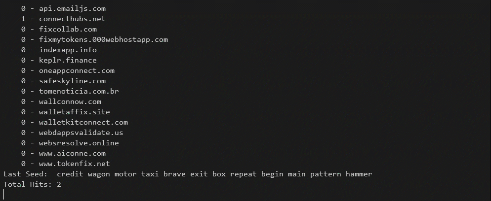

# Fake Seed Phrase Spammer

a smoll but very fast script to fuck scammers by sending tons of fake seed phrases 💥

uses dank worker threads for speedz and supports spamming multiple targets at once


## Demo



## Install

```bash
pnpm i
```

## Configure

1. Open devtools network tab
2. Send fake seed phrase request to shitty scummy scam website
3. Copy request as fetch
4. Add as a function to the [`toSpam.js`](./toSpam.js) array, do not forget to replace seed phrase

## Run

```bash
pnpm start
```

## License

```
           DO WHAT THE FUCK YOU WANT TO PUBLIC LICENSE
                   Version 2, December 2004

Copyright (C) 2022 rigwild <me@rigwild.dev> (https://rigwild.dev/)

Everyone is permitted to copy and distribute verbatim or modified
copies of this license document, and changing it is allowed as long
as the name is changed.

           DO WHAT THE FUCK YOU WANT TO PUBLIC LICENSE
  TERMS AND CONDITIONS FOR COPYING, DISTRIBUTION AND MODIFICATION

 0. You just DO WHAT THE FUCK YOU WANT TO.
```
